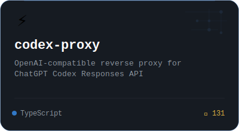
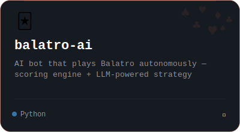
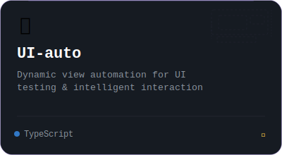

<!-- ============================================ -->
<!-- 🐻 HEADER BANNER                              -->
<!-- Replace with your custom SVG from Gemini      -->
<!-- ============================================ -->
<div align="center">
  
</div>

<br/>

<!-- ============================================ -->
<!-- 🧊 INTRO                                      -->
<!-- ============================================ -->
<div align="center">

### `> icebear@dev ~$ whoami`

**Full-stack Developer · AI Agent Builder · Reverse Engineer**

I build autonomous AI systems that think, act, and adapt.

[](https://github.com/icebear0828)
[](https://github.com/icebear0828)

</div>

<!-- ============================================ -->
<!-- 📊 STATS                                      -->
<!-- ============================================ -->

<div align="center">
  
  &nbsp;&nbsp;
  
</div>

<br/>

<div align="center">
  
</div>

<br/>

<!-- ============================================ -->
<!-- 🔥 FEATURED PROJECTS                          -->
<!-- Custom SVG cards — replace with Gemini output -->
<!-- ============================================ -->

<div align="center">

## ⚡ Featured Projects

</div>

<br/>

<!--
  💡 PROJECT CARD INSTRUCTIONS FOR GEMINI:

  Create 3 custom SVG project cards (400×220 each).
  Style: dark glassmorphism (bg: rgba(22,27,34,0.8), border: 1px solid rgba(88,166,255,0.2))
  Rounded corners (16px), subtle glow on hover-state variant

  Each card should contain:
  - Project icon/emoji (top-left)
  - Project name (bold, white)
  - One-line description (gray, #8b949e)
  - Language badge (colored dot + name)
  - Star count
  - A subtle decorative element unique to each project

  Card 1 — codex-proxy:   icon ⚡, accent #58a6ff (blue),  "TypeScript" badge, ⭐ 131
  Card 2 — balatro-ai:    icon 🃏, accent #ff6e40 (orange), "Python" badge
  Card 3 — UI-auto:       icon 🎯, accent #a78bfa (purple), "TypeScript" badge

  Export as: assets/card-codex-proxy.svg, assets/card-balatro-ai.svg, assets/card-ui-auto.svg
-->

<div align="center">
<table>
<tr>

<td align="center" width="33%">
<a href="https://github.com/icebear0828/codex-proxy">

</a>
<br/>
<sub><b>⚡ codex-proxy</b></sub>
<br/>
<sub>OpenAI-compatible reverse proxy for<br/>ChatGPT Codex Responses API</sub>
<br/><br/>


</td>

<td align="center" width="33%">
<a href="https://github.com/icebear0828/balatro-ai">

</a>
<br/>
<sub><b>🃏 balatro-ai</b></sub>
<br/>
<sub>AI bot that plays Balatro autonomously —<br/>scoring engine + LLM strategy</sub>
<br/><br/>


</td>

<td align="center" width="33%">
<a href="https://github.com/icebear0828/UI-auto">

</a>
<br/>
<sub><b>🎯 UI-auto</b></sub>
<br/>
<sub>Dynamic view automation<br/>for UI testing & interaction</sub>
<br/><br/>


</td>

</tr>
</table>
</div>

<br/>

<!-- ============================================ -->
<!-- 🛠 TECH STACK                                 -->
<!-- ============================================ -->

<div align="center">

## 🛠 Tech Stack

**Languages**


**Frameworks & Runtime**


**AI & Infrastructure**


</div>

<br/>

<!-- ============================================ -->
<!-- 🐍 CONTRIBUTION SNAKE                         -->
<!-- Requires GitHub Action: Platane/snk           -->
<!-- ============================================ -->

<div align="center">

## 📈 Contribution Graph

<picture>
  <source media="(prefers-color-scheme: dark)" srcset="https://raw.githubusercontent.com/icebear0828/icebear0828/output/github-snake-dark.svg" />
  <source media="(prefers-color-scheme: light)" srcset="https://raw.githubusercontent.com/icebear0828/icebear0828/output/github-snake.svg" />
  
</picture>

</div>

<br/>

<!-- ============================================ -->
<!-- 🦶 FOOTER                                     -->
<!-- ============================================ -->

<div align="center">

<!-- Replace with custom wave SVG from Gemini -->


<br/><br/>

```
⠀⠀⠀⠀⠀⠀⠀⠀⠀⠀⠀⠀⠀⠀⠀⠀⠀⠀⠀"The best way to predict the future is to build it."⠀⠀⠀⠀⠀⠀⠀⠀⠀⠀⠀⠀⠀⠀⠀⠀⠀⠀⠀
```

</div>
